# AI
Repo for Artificial Intelligence project in MCS @ TCD

Greg (2021). gsurma/slitherin. `[online]` GitHub. Available at: https://github.com/gsurma/slitherin `[Accessed 15 Mar. 2021].`

Table of Contents
=================

  * [Usage](#usage)
  * [Cross Validation](#Cross Validation)
  * [Rules](#rules)
  * [Modes](#modes)
     * [Domain specific](#domain-specific)
        * [Shortest Path BFS](#shortest-path-bfs)
        * [Shortest Path DFS](#shortest-path-dfs)
        * [Longest path](#longest-path)
        * [Hamilton](#hamilton)
        * [DNN](#dnn)
        * [DNN Monte Carlo](#dnn-monte-carlo)
     * [General purpose](#general-purpose)
        * [Human](#human)
        * [Random](#random)
        * [Monte Carlo](#monte-carlo)
        * [DNN Genetic Evolution](#dnn-genetic-evolution)

## Usage

1. Clone the repo.
2. Go to the project's root folder.
3. Install required packages`pip install -r requirements.txt`.
4. Launch slitherin. I recommend starting with the help mode to see all available modes `python slitherin.py --help`.

**Note** : The changes to the env that allow for extra fruit or an additional boost to the length of the snake were
only taken into account in the following algorithms, as the report illustrates:
* A*
* Hamiltonian Cycles
* Genetic Evolution
* DQN

## Cross Validation
1. Use the *analysis.py* file
2. See the arguments using 
```
python analysis.py --help
``` 
giving
```
optional arguments:
  -h, --help     show this help message and exit
  -a, --a_star   Flag for performing analysis on a star
  -g, --genetic  Flag for performing analysis on genetic algorithms
```
For the specified model, yields plots such as those below

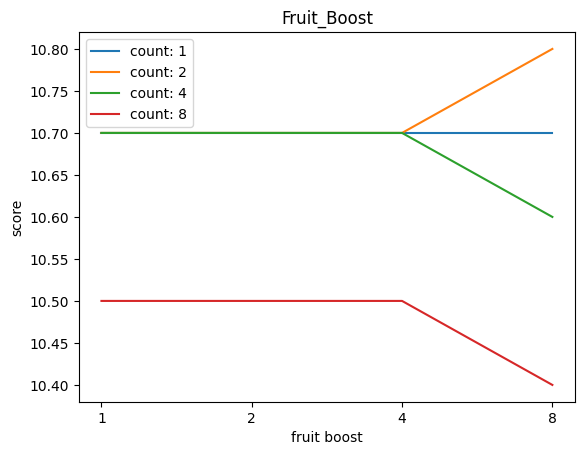

## Rules
1. Snake has to move either forward, left or right.
2. Snake dies when hits wall or itself.
3. For every eaten fruit, snake's length increases by 1 and a new fruit is generated on a random unoccupied place.

## Modes
All mode previews contain <span style="color:green">current score</span> **Mode Name (min/avg/max)**.
All modes are benchmarked on a 12x12 grid.

### Domain specific
> Algorithms are using domain specific data like snake's position, direction, neighbors etc.


#### Shortest Path BFS
`python slitherin.py --shortest_path_bfs`

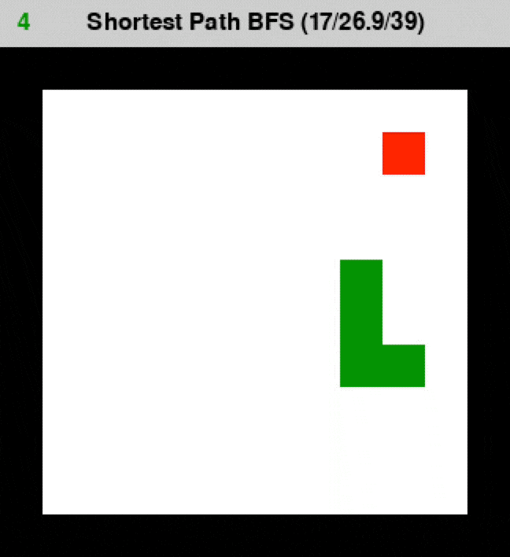
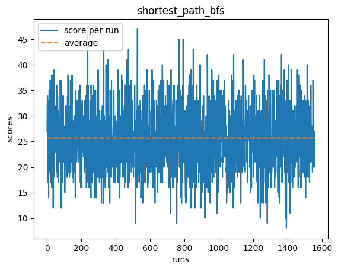

Generates the shortest path from the snake’s head to the fruit using BFS algorithm.

Optimal performance during early stages, but as the snake grows, its body creates an unavoidable obstacle for the leading head. 

---

#### Shortest Path DFS
`python slitherin.py --shortest_path_dfs`

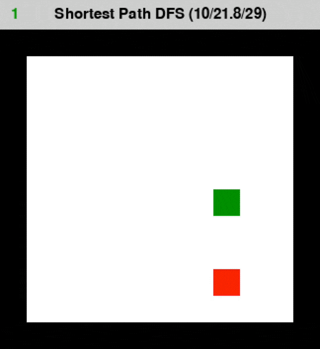
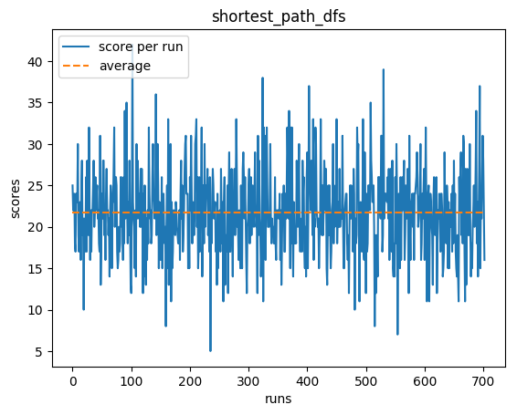

Generates the shortest path from the snake’s head to the fruit using DFS algorithm.

Performs worse than BFS due to the graph’s cyclicity.

---

#### Longest path
`python slitherin.py --longest_path`

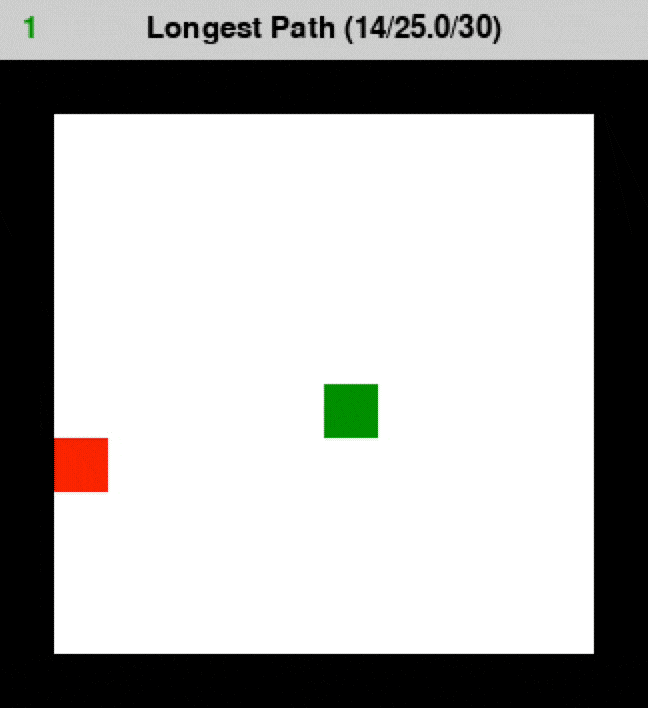
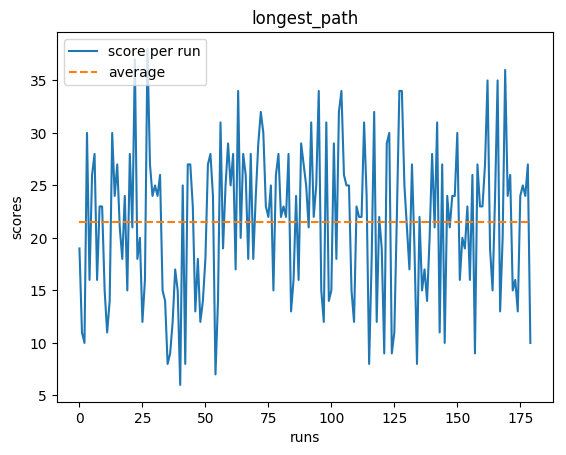

Firstly, generates the shortest path (BFS) between the snake’s head and the fruit. Then for each pair of points in the path, tries to extend the distance between them with available actions.

Snake dies when its body is on a generated path.

---

#### Hamilton
`python slitherin.py --hamilton`

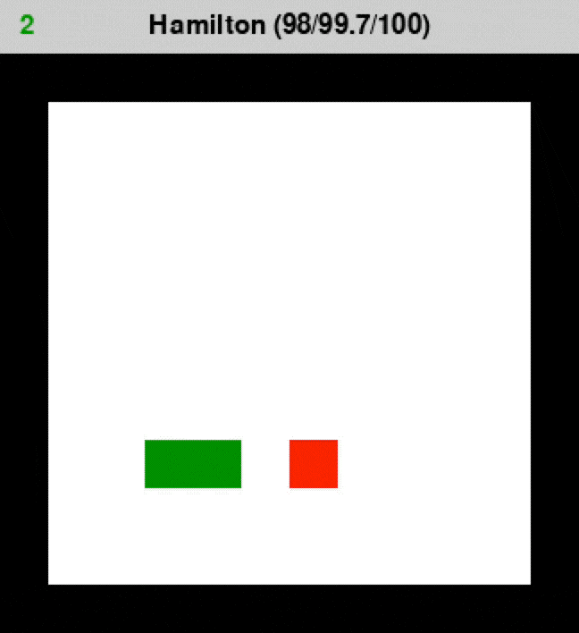
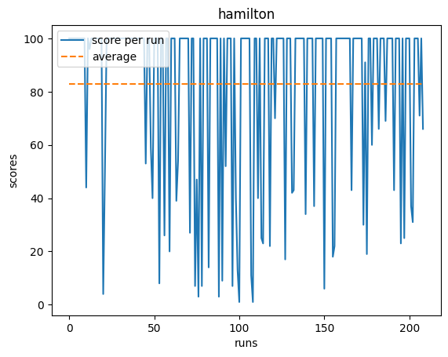

Generates a longest path between the snake’s head and its tail. 

In the vast majority of the cases, such path covers the whole environment creating [Hamiltonian path](https://en.wikipedia.org/wiki/Hamiltonian_path), thus solving the game of snake with a perfect score.

---

#### DNN

> Each Deep Neural Net mode has a same model structure of:
> 
> * input layer with 5 neurons [action\_vector, left\_neighbor, forward\_neighbor, right\_neighbor, angle\_to\_fruit]
> * hidden layer with 125 neurons (ReLU 6 activation)
> * output layer with 1 neuron (value for a given action\_vector)

`python slitherin.py --deep_neural_net`

`python slitherin.py --deep_neural_net_trainer`

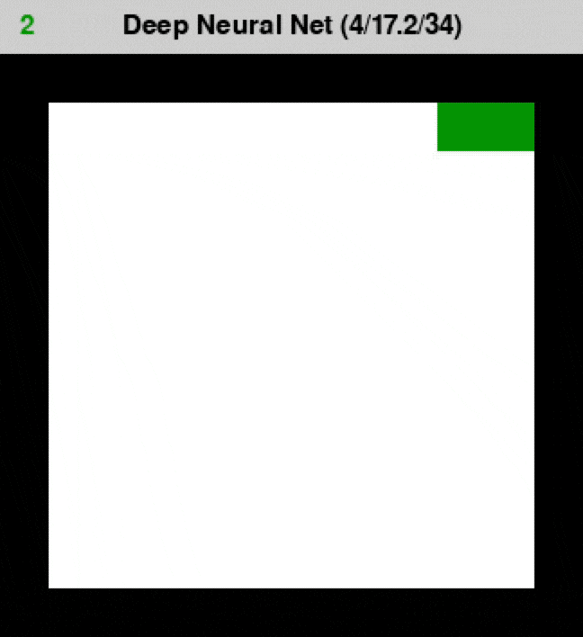
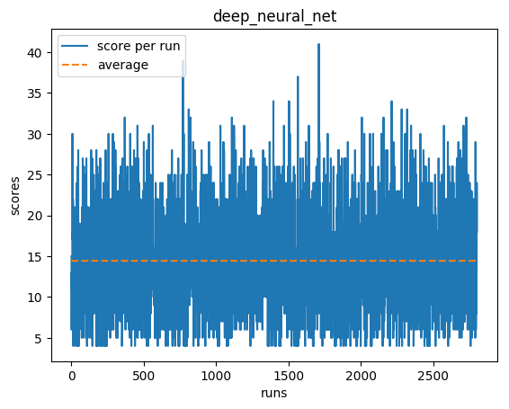

Training phase consists of performing random gameplays followed by the evaluation and backpropagation of performed actions and its results. 

Rewards:

* **0.7** for eating the fruit
* **0.1** for moving towards the fruit
* **-0.2** for moving away of the fruit
* **-1.0** for dying

As expected, DNN solver performs well in the early stages. Snake goes straight to the fruit and doesn't go into cycles. However as it gets longer, it starts to have problems with going around itself. With the current model structure (data about only the nearest surroundings), a snake doesn't indicate any sense of 'the whole environment orientation and position'

---

#### DNN Monte Carlo
`python slitherin.py --deep_neural_net_monte_carlo`

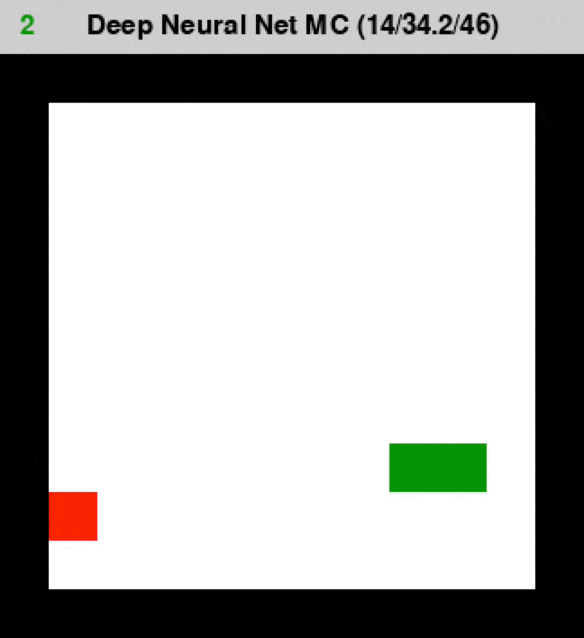
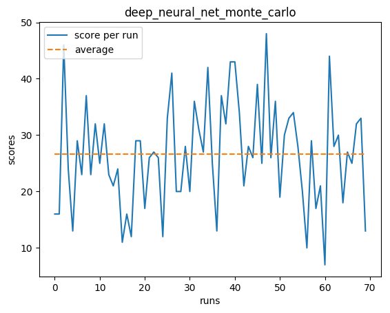

For each possible action, there is a DNN-driven gameplay generated. Gameplay with the highest score is chosen for an ultimate move.

Very slow and inefficient performance in the beginning, but favorable in the late stages. DNN-driven simulations allow the snake to choose relatively wise long-term moves.


---

### General purpose
> Algorithms are not using any domain specific data.


#### Human 
`python slitherin.py --human`

Used for debug, development and fun:).

---

#### Random 
`python slitherin.py --random`

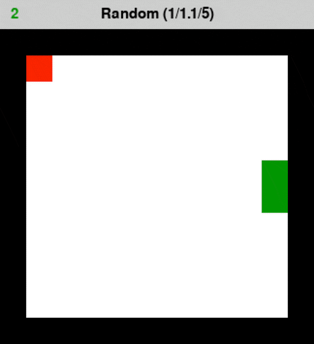
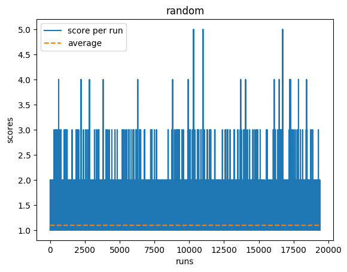


It's always good to start benchmarking against randomness (at least pseudo).

As expected, very low performance.

---

#### Monte Carlo 
`python slitherin.py --monte_carlo`

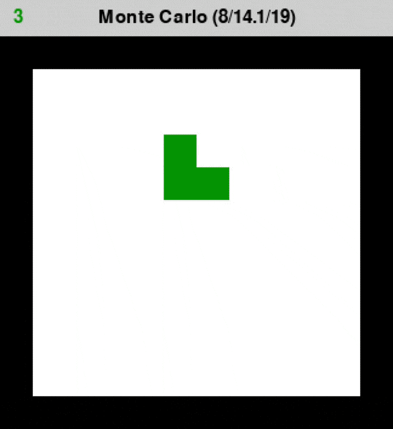
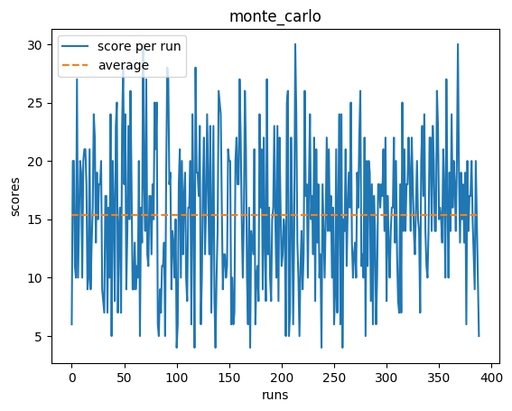

For each move, performs a set of 1000 random run simulations. Then groups them by the initial action and finally picks the action that started gameplays with the highest average score.

Slow and weak performance.

---

#### DNN Genetic Evolution
`python slitherin.py --deep_neural_net_genetic_evolution`

`python slitherin.py --deep_neural_net_genetic_evolution_trainer`

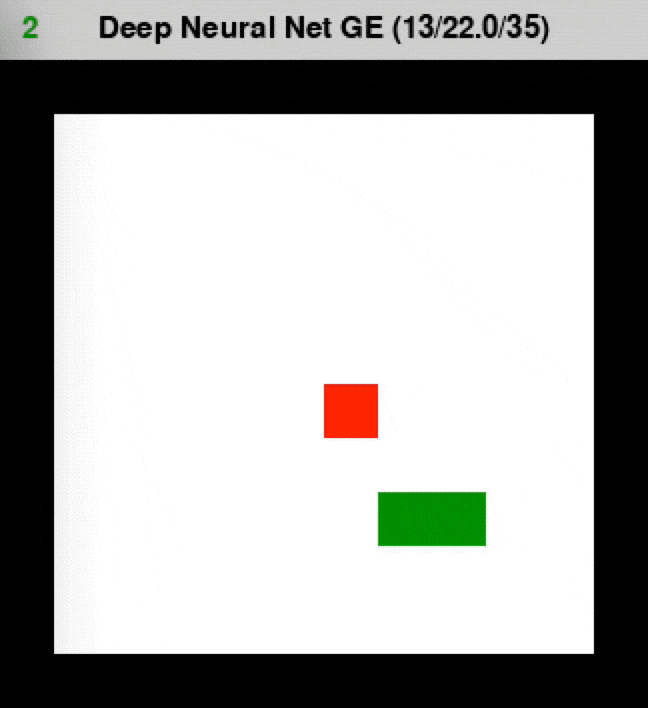
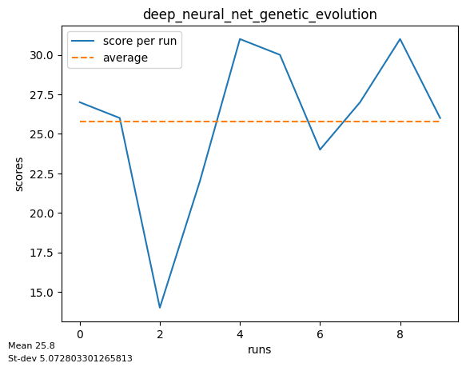

Initial population starts with random weights. Then in the selection phase, the top 0.1 of the population gets picked to the uniform crossover stage. In the crossover phase, parents are paired using roulette selection (the highest the score, the highest the probability of breeding). Finally, in the mutation phase, 0.01 of the weights of all offsprings are being mutated to the random values. Then we start again with a new population created fully by the newly bred offsprings. Above cycle is being repeated until convergence which happens usually around 25th generation and the average score of 22.

Performance is relatively satisfactory. Snake correctly learned that taking the shortest path to the fruit isn't a good solution in the late stages, but ultimately still gets trapped within its own body.
